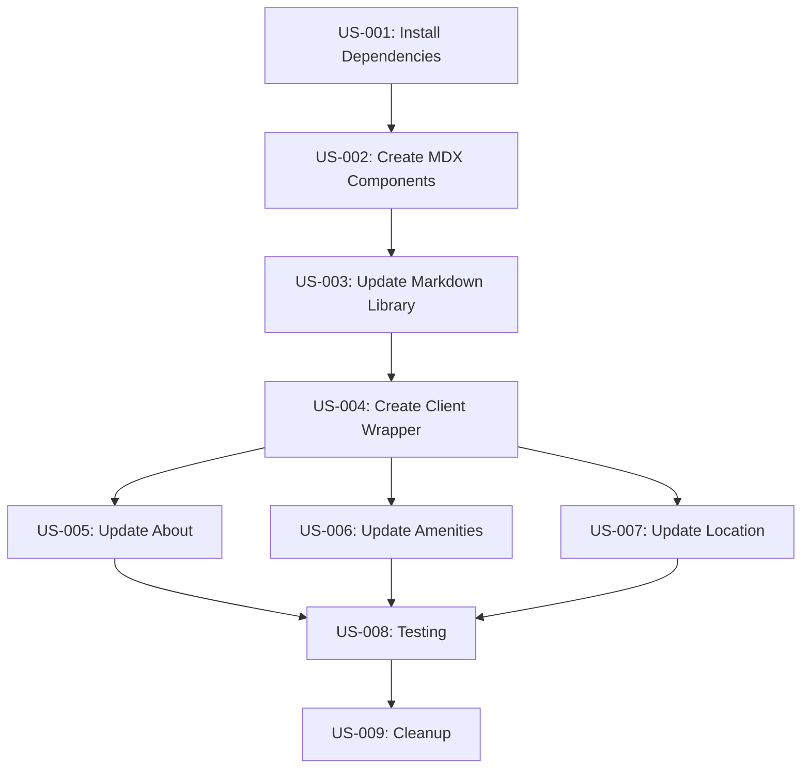

# EPIC-001: Migrate to MDX - Complete Backlog Summary

## Epic Overview

**Title**: Migrate from marked to next-mdx-remote
**Status**: To Do
**Priority**: Medium
**Total Story Points**: 14
**Estimated Time**: 4-6 hours

## Quick Links

- [Epic Details](./epic.md)
- [Backlog README](../../README.md)

## Structure Overview

This epic contains **9 user stories** with a total of **17 tasks**.

## User Stories Breakdown

### 📦 US-001: Install Dependencies

**Story Points**: 1 | **Status**: To Do
**Description**: Install next-mdx-remote and all required plugins

**Tasks**:

1. ✅ [TASK-001](./user-stories/US-001-install-dependencies/tasks/TASK-001-install-core-packages.md): Install Core Packages (5 min)
2. ✅ [TASK-002](./user-stories/US-001-install-dependencies/tasks/TASK-002-install-remark-plugins.md): Install Remark Plugins (3 min)
3. ✅ [TASK-003](./user-stories/US-001-install-dependencies/tasks/TASK-003-install-rehype-plugins.md): Install Rehype Plugins (5 min)
4. ⭕ [TASK-004](./user-stories/US-001-install-dependencies/tasks/TASK-004-install-syntax-highlighting.md): Install Syntax Highlighting - Optional (5 min)

---

### 🎨 US-002: Create MDX Component Mapping

**Story Points**: 2 | **Status**: To Do
**Description**: Create component mapping for MDX elements and custom shortcodes

**Tasks**:

1. ✅ [TASK-001](./user-stories/US-002-create-mdx-components/tasks/TASK-001-create-base-component-map.md): Create Base Component Map (15 min)
2. ✅ [TASK-002](./user-stories/US-002-create-mdx-components/tasks/TASK-002-add-custom-shortcodes.md): Add Custom Shortcode Components (20 min)

**Deliverables**:

- `/components/mdx-components.tsx` with Link, Image overrides
- Custom components: Callout, BookingCTA, FeatureHighlight

---

### 📚 US-003: Update Markdown Library

**Story Points**: 3 | **Status**: To Do
**Description**: Update markdown library to use MDX serialization

**Tasks**:

1. ✅ [TASK-001](./user-stories/US-003-update-markdown-library/tasks/TASK-001-update-library-imports.md): Update Library Imports and Configuration (25 min)

**Deliverables**:

- Updated `/lib/markdown.ts` with next-mdx-remote
- Plugin pipeline configured
- TypeScript interfaces updated

---

### 🔌 US-004: Create Client Wrapper Component

**Story Points**: 1 | **Status**: To Do
**Description**: Create client wrapper for MDXRemote rendering

**Tasks**:

1. ✅ [TASK-001](./user-stories/US-004-create-client-wrapper/tasks/TASK-001-create-client-wrapper.md): Create Client Wrapper (10 min)

**Deliverables**:

- `/components/mdx-remote-client.tsx` with 'use client' directive

---

### 📄 US-005: Update About Component

**Story Points**: 1 | **Status**: To Do
**Description**: Update About component to use MDX rendering

**Tasks**:

1. ✅ [TASK-001](./user-stories/US-005-update-about-component/tasks/TASK-001-update-about-component.md): Update About.tsx (10 min)

**Changes**:

- Replace dangerouslySetInnerHTML with MDXClient
- Update to use mdxSource prop

---

### 🏠 US-006: Update Amenities Component

**Story Points**: 1 | **Status**: To Do
**Description**: Update Amenities component to use MDX rendering

**Tasks**:

1. ✅ [TASK-001](./user-stories/US-006-update-amenities-component/tasks/TASK-001-update-amenities-component.md): Update Amenities.tsx (10 min)

**Changes**:

- Replace dangerouslySetInnerHTML with MDXClient
- Preserve icon grid display

---

### 📍 US-007: Update Location Component

**Story Points**: 1 | **Status**: To Do
**Description**: Check and update Location component if it uses markdown

**Tasks**:

1. ✅ [TASK-001](./user-stories/US-007-update-location-component/tasks/TASK-001-check-location-component.md): Check and Update Location.tsx (15 min)

**Notes**:

- May not need changes if component doesn't use markdown
- Conditional based on component implementation

---

### 🧪 US-008: Testing and Validation

**Story Points**: 2 | **Status**: To Do
**Description**: Comprehensive testing of MDX implementation

**Tasks**:

1. ✅ [TASK-001](./user-stories/US-008-testing-validation/tasks/TASK-001-test-page-rendering.md): Test Page Rendering (20 min)
2. ✅ [TASK-002](./user-stories/US-008-testing-validation/tasks/TASK-002-verify-styling.md): Verify Styling (15 min)
3. ✅ [TASK-003](./user-stories/US-008-testing-validation/tasks/TASK-003-check-console-errors.md): Check Console Errors (10 min)

**Test Coverage**:

- All page sections render correctly
- Styling and layout preserved
- No console errors or warnings
- Responsive design intact
- Cross-browser compatibility

---

### 🧹 US-009: Cleanup and Finalization

**Story Points**: 1 | **Status**: To Do
**Description**: Remove old dependencies and finalize migration

**Tasks**:

1. ✅ [TASK-001](./user-stories/US-009-cleanup-finalization/tasks/TASK-001-remove-marked.md): Remove Marked Package (5 min)
2. ✅ [TASK-002](./user-stories/US-009-cleanup-finalization/tasks/TASK-002-final-git-commit.md): Create Git Commit (10 min)

**Deliverables**:

- marked package removed
- Clean git commit with migration changes
- Updated documentation

---

## Execution Order



## Progress Tracking

### Completion Checklist

- [ ] US-001: Install Dependencies (4 tasks)
- [ ] US-002: Create MDX Components (2 tasks)
- [ ] US-003: Update Markdown Library (1 task)
- [ ] US-004: Create Client Wrapper (1 task)
- [ ] US-005: Update About Component (1 task)
- [ ] US-006: Update Amenities Component (1 task)
- [ ] US-007: Update Location Component (1 task)
- [ ] US-008: Testing and Validation (3 tasks)
- [ ] US-009: Cleanup and Finalization (2 tasks)

**Total Tasks**: 17 (16 required + 1 optional)

### Time Estimates

| Phase              | User Stories           | Tasks  | Estimated Time |
| ------------------ | ---------------------- | ------ | -------------- |
| Setup              | US-001                 | 4      | 20-25 min      |
| Component Creation | US-002, US-003, US-004 | 4      | 70 min         |
| Component Updates  | US-005, US-006, US-007 | 3      | 30-35 min      |
| Testing            | US-008                 | 3      | 45 min         |
| Finalization       | US-009                 | 2      | 15 min         |
| **TOTAL**          | **9**                  | **17** | **3-4 hours**  |

## Key Dependencies

```
next-mdx-remote (new)
├── remark-gfm
├── rehype-slug
├── rehype-autolink-headings
└── rehype-pretty-code (optional)
    └── shiki

marked (to be removed)
```

## Files to be Created

- `/components/mdx-components.tsx` - Component mapping
- `/components/mdx-remote-client.tsx` - Client wrapper

## Files to be Modified

- `/lib/markdown.ts` - Core library update
- `/components/About.tsx` - MDX rendering
- `/components/Amenities.tsx` - MDX rendering
- `/components/Location.tsx` - MDX rendering (if applicable)
- `/package.json` - Dependencies
- `/package-lock.json` - Lock file

## Success Criteria

✅ All user stories complete
✅ All acceptance criteria met
✅ Zero console errors
✅ All tests passing
✅ Build succeeds
✅ Content renders correctly
✅ Styling preserved
✅ Documentation updated
✅ Git commit created

## Risk Assessment

| Risk                 | Likelihood | Impact | Mitigation                   |
| -------------------- | ---------- | ------ | ---------------------------- |
| Breaking rendering   | Medium     | High   | Thorough testing, git backup |
| Bundle size increase | High       | Medium | Monitor and optimize         |
| Plugin conflicts     | Low        | Medium | Use stable, popular plugins  |
| Styling breaks       | Medium     | High   | Verify prose classes apply   |

## Rollback Plan

1. `git revert [commit-hash]` - Revert migration commit
2. `npm install marked` - Reinstall marked if needed
3. Build and verify rollback successful

## Next Steps After Completion

1. ✨ Add custom MDX components to content files
2. 📝 Create content authoring guide
3. 🎨 Add more custom shortcode components
4. 🔍 Consider adding search indexing
5. 📊 Monitor performance metrics

## Questions or Issues?

- See [Epic Details](./epic.md) for full context
- Check [Backlog README](../../README.md) for structure info
- Review individual task files for detailed instructions
- Each task has an "Agent Prompt" section for AI assistants

---

**Created**: 2025-10-20
**Last Updated**: 2025-10-20
**Version**: 1.0
**Epic Owner**: TBD
